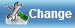

.. toctree::
   :maxdepth: 1

Buttons
=======

The advantum software development framework consists of many predefined buttons. Buttons are defined by creating
a **span** html element with a button **attribute** and **type**. Only the style of the button is changed with the type attribute,
fucntionality is added with custom javascript functions.   

Button Types
------------

The various button types and how they are rendered are listed below:

accept
~~~~~~

Accept button html code example and how it is rendered is shown below:

.. code-block:: html

   

.. image:: accept.png
   :height: 100px
   :width: 200 px
   :scale: 50 %
 
add
~~~~~~

Add button html code example and how it is rendered is shown below:

.. code-block:: html

   

     
apply
~~~~~~

Apply button html code example and how it is rendered is shown below:

.. code-block:: html

   

back
~~~~~~

Back button html code example and how it is rendered is shown below:

.. code-block:: html

   

.. image:: back.png
   :height: 100px
   :width: 200 px
   :scale: 50 %

cancel
~~~~~~

Cancel button html code example and how it is rendered is shown below:

.. code-block:: html

   
   

   
change
~~~~~~

Change button html code example and how it is rendered is shown below:

.. code-block:: html

   
 

  
close
~~~~~~

Close button html code example and how it is rendered is shown below:

.. code-block:: html

   

.. image:: close.png
	:height: 100px
	:width: 200 px
	:scale: 50 %

delete
~~~~~~

Delete button html code example and how it is rendered is shown below:

.. code-block:: html

   

edit
~~~~~~

Edit button html code example and how it is rendered is shown below:

.. code-block:: html

   
   
.. image:: edit.png
	:height: 100px
	:width: 200 px
	:scale: 50 %

exit
~~~~~~

Exit button html code example and how it is rendered is shown below:

.. code-block:: html

   

	
new
~~~~~~

New button html code example and how it is rendered is shown below:

.. code-block:: html

   

.. image:: new.png
	:height: 400px
	:width: 400 px
	:scale: 50 %

print
~~~~~~

Print button html code example and how it is rendered is shown below:

.. code-block:: html

   

.. image:: print.png
	:height: 100px
	:width: 200 px
	:scale: 50 %

refresh
~~~~~~

Refresh button html code example and how it is rendered is shown below:

.. code-block:: html

   
 
.. image:: refresh.png
	:height: 100px
	:width: 200 px
	:scale: 50 %

recycle
~~~~~~

Recycle button html code example and how it is rendered is shown below:

.. code-block:: html

   
   
    

save
~~~~~~

Save button html code example and how it is rendered is shown below:

.. code-block:: html

   
   
.. image:: save.png
	:height: 100px
	:width: 200 px
	:scale: 50 %

Other Button Attributes
-----------------------
	
text
~~~~~~

This is the text which is displayed on the button. A buttons default text can be overriden using this attribute, as shown below:

.. code-block:: html

   

width
~~~~~~

The **width** property sets the width of a button element.

.. code-block:: html

   

height
~~~~~~

The **height** property sets the height of a button element.

.. code-block:: html

   
