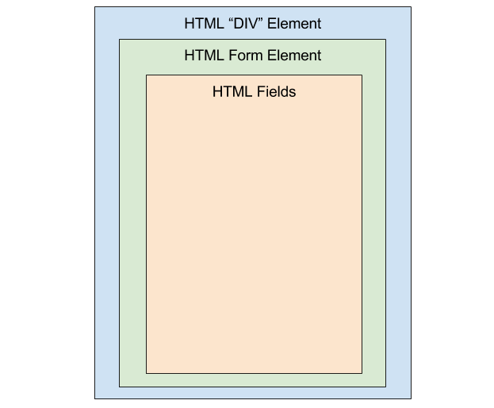

.. toctree::
   :maxdepth: 1

Forms
=====

A webform, web form or HTML form on a web page allows a
user to enter data that is sent to a server for processing.
Forms can resemble paper or database forms because web users fill out the forms using checkboxes,
radio buttons, or text fields. For example, forms can be used to enter shipping or

Defining A Form
----------------

A form typically consists of three sections:

1. parent **div** html element.

2. form html element within the **div**.

3. and fields within the form **element** *(to see more information regarding fields click here)*.

A diagram of the form structure is shown below:

Parent Div Element
~~~~~~~~~~~~~~~~~~

The parent **div** typically has the following attributes **id** which is the identifier,
**style** which is normally set to **display:none** and **class** which is always set with a
value of **"window"**. An example is shown below:

.. literalinclude:: forms_example.html
       :language: html
       :lines: 61-65

Form Element
~~~~~~~~~~~~

The form element is defined only with a **name* attribute which is the unique identifier
of the form and example is shown below:

.. literalinclude:: forms_example.html
       :language: html
       :lines: 67-70

Title
~~~~~~~~~~~~

A optional **title** can be added to the form. It is defined using a **div** with an **id** which is the unique identifier and a
**class** which must have the value **"titleBar"** an example is shown below:

       .. literalinclude:: forms_example.html
              :language: html
              :lines: 73

Fields
~~~~~~

Fields are used for both input and output and are defined within the form element:

.. note::  Read the `Fields`_ for more detailed information

.. literalinclude:: forms_example.html
       :language: html
       :lines: 63

- A complete example of a form in shown below:

.. literalinclude:: forms_example.html
       :language: html
       :lines: 77-91

Form Utility Methods
--------------------
The form utilizes several custom javascript functions to facilitate form manipulation, these functions are described below:

saveVar();
~~~~~~~~~~

The **saveVar()** function saves the current state of a form and it is always called immediately after the form has been initialized.

- It can be used to save the entire form as shown below:

.. literalinclude:: form_functions.html
       :linenos:
       :language: javascript
       :lines: 28 - 31
       :emphasize-lines: 3

- It can also be used to save specific fields as shown below:

.. literalinclude:: form_functions.html
       :linenos:
       :language: javascript
       :lines: 33

returnChangedVar();
~~~~~~~~~~~~~~~~~~~

The **returnChangedVar** function returns all the form elements which have been changed after a the **saveVar()** function is called.

- If it is called without any parameters it will return a list of the fields which have been changed, as shown in the example below:

.. literalinclude:: form_functions.html
       :linenos:
       :language: javascript
       :lines: 42-48
       :emphasize-lines: 1

- If it is called with the **array** parameter it will return the array of fields which have been shown in the example below:

 .. literalinclude:: form_functions.html
        :linenos:
        :language: javascript
        :lines: 50-56
        :emphasize-lines: 1

restoreVar();
~~~~~~~~~~~~~

The **restoreVar** function restores the value of fields within a form if they have been modified.

- If it is called without parameters it will restore the value of all fields in the current form:

.. literalinclude:: form_functions.html
       :linenos:
       :language: javascript
       :lines: 58-60
       :emphasize-lines: 2

- It can also be called with one or more fields which require restoration as shown below:

.. literalinclude:: form_functions.html
       :linenos:
       :language: javascript
       :lines: 62-64
       :emphasize-lines: 2

hasChangedVar();
~~~~~~~~~~~~~~~~

The **hasChangedVar** function returns a boolean value if any fields have been changed:

- If it is called without parameters it scans the entire form and returns true or false if any of the fields have been altered.

.. literalinclude:: form_functions.html
       :language: javascript
       :lines: 69-71

- It can also be called with with one or more field names as parameters to determine if either of them has been changed. An example is shown below:

 .. literalinclude:: form_functions.html
        :language: javascript
        :lines: 69-71

savedValueOf();
~~~~~~~~~~~~~~~

The savedValueOf returns the value of a field. An example of its usage is shown below:

.. literalinclude:: form_functions.html
       :linenos:
       :language: javascript
       :lines: 66

displayForm();
~~~~~~~~~~~~~~

This function displays the form if it was hidden. It accepts the form to display as its parameter:

.. literalinclude:: forms_example.html
       :language: javascript
       :lines: 21

panel();
~~~~~~~
- output are panel
- button panel
