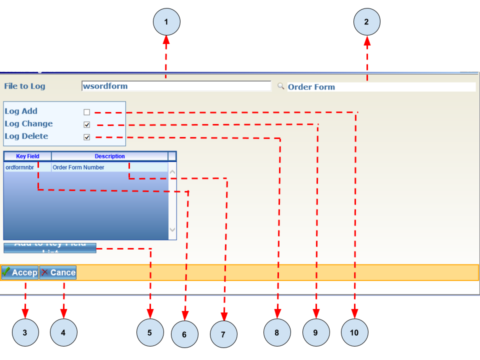
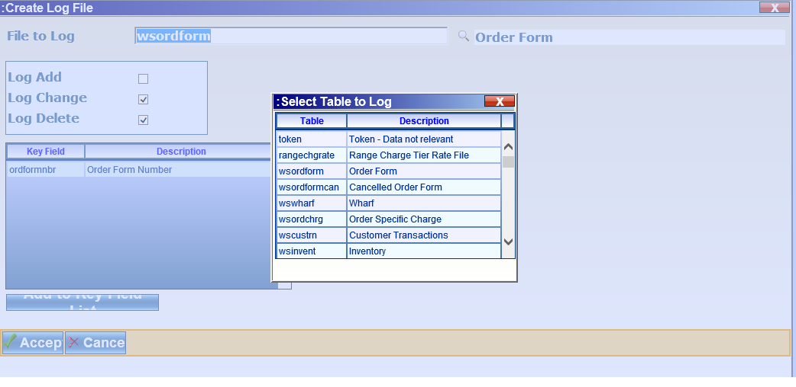
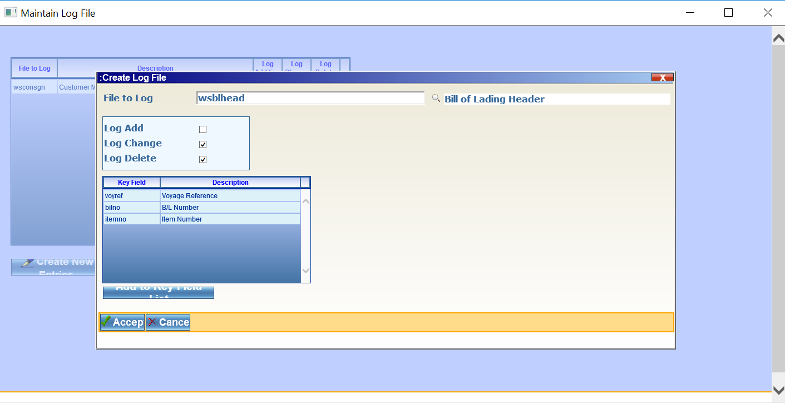

.. toctree::
   :maxdepth: 1

Database Logging
===============

Overview
--------

Database logging is an integral feature of the **Advantum Software Development Framework**. All database actions which
alter the contents of tables are captured automatically by the logging framework.

MAINTAINLOGFILE Program
-----------------------

The **MAINTAINLOGFILE** is used to configure the table(s) and actions which will be logged for each table. Actions which can be
logged for each table are:

1. Addition - This is when a record is added to a table.
2. Change - This when a record is updated.
3. Delete - This is when a record is removed from the table.

- The diagram below shows an image of the **MAINTAINLOGFILE** table.

.. image:: MaintainLog.png

It consists of seven(7) main sections which are described below:

1. File to Log - This represents the table(s) which will be logged.
2. Description - This is a user friendly description of the table.
3. Log Addition - If this option is selected all records which will be **added** will be logged.
4. Log Change - If this option is selected all records which have been **changed**  will be logged.
5. Log Delete - If this option is selected all records which have been **deleted** will be logged.
6. Create New Entries - *Allow for the addition and configuration of tables for logging.
7. Refresh - Restores the application to its default state.

Creating Log File Screen
------------------------

When The **Create New Entries** button is clicked it will show the **Creating Log File Screen** which is shown below:

It consists of the ten(10) sections which are described below:

1. **File to Log** - This a search field which allows database tables to be selected. It launches a window showing a list of
   all tables when the mouse cursor is place in the field. An example is shown below:

   .. image:: tableList.png

2. **Table Description** - This is a description of the table to be logged.

3. **Accept Button** - This allows the changes made to be saved.

4. **Cancel Button** - Returns the user to the **MAINTAINLOGIFILE** application.

5. **Add To Key Field To List** - Adds fields that will always be logged. By default the primary key of the table is added.

6. **Key Field** - This is the name of the filed(s) which are to be logged.

7. **Description** - This is the field description.

8. **Log Delete** - If this option is checked all delete operations on the table will be logged.

9. **Log Change** - If this option is checked all update operations on the table will be logged.

10. **Log Add** - If this option is checked all insert operations on the table will be logged.

Adding A Log Table
------------------

Step One - Add a table
~~~~~~~~~~~~~~~~~~~~~~

To add a table, click in the **File to Log** field and choose a table. As shown below:

Step Two - Add additional columns
~~~~~~~~~~~~~~~~~~~~~~~~~~~~~~~~~

By default the primary keys for the table are added as shown below:

.. note:: Other columns can be added to the primary key list. These columns would become mandatory for logging and are selected
          by default when the reporting tool is launched.

Step Three - Accept the changes
~~~~~~~~~~~~~~~~~~~~~~~~~~~~~~~

Click the **Accept Button** to apply the changes. 

Viewing The Logs
----------------

The PRINTABLELOG Program
~~~~~~~~~~~~~~~~~~~~~~~~

To **PRINTABLELOG** program allows logs to be viewed. The image below shows the **PRINTTABLELOG** program.
